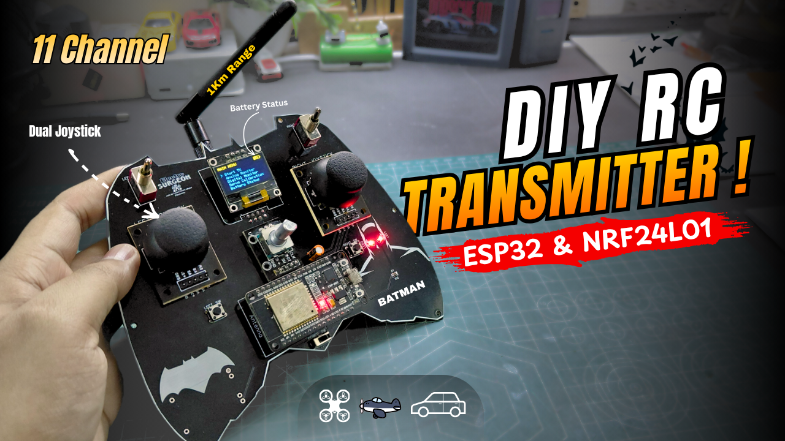
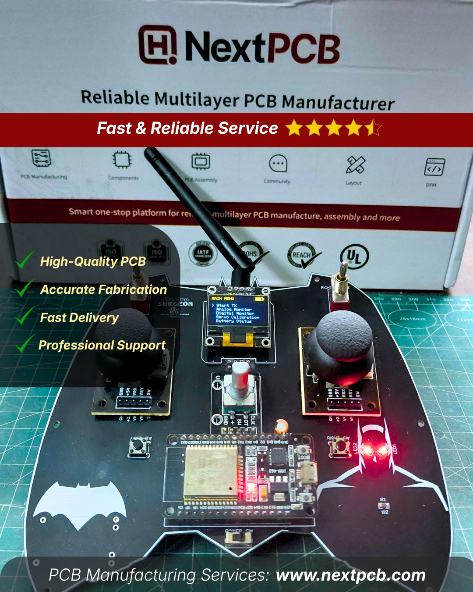
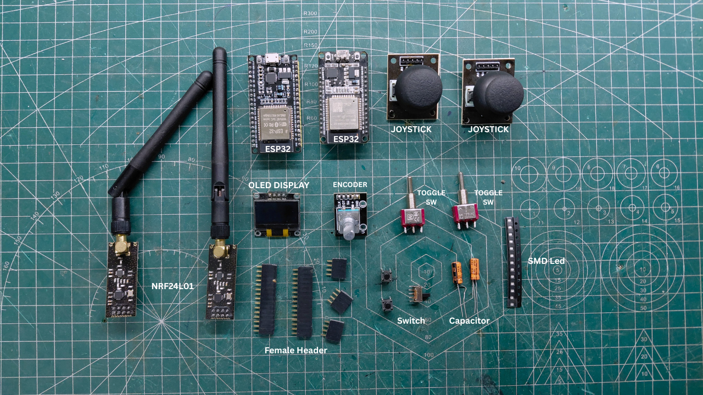
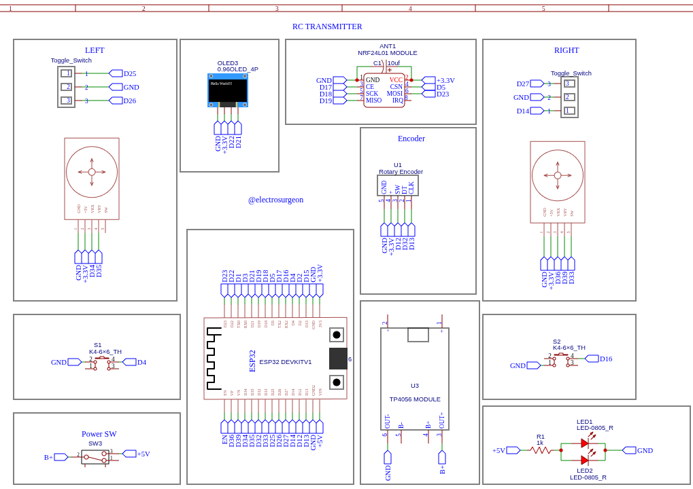

# DIY-11-Channel-RC-Transmitter-BATMAN-Edition-ESP32-nRF24L01
ESP32 + nRF24L01 | Control Car, Drone &amp; Robot
Build your own 11 Channel DIY RC Transmitter using ESP32 and NRF24L01 with long-range wireless communication (~1KM)! 🚀

In this project, I designed a custom PCB RC controller with dual joysticks, OLED display, rotary encoder, and multiple switches — giving full control for RC cars, drones, planes, and robotics.

I used NextPCB for manufacturing my custom RC transmitter PCB, and the results were impressive. The build quality, accurate finishing, and quick delivery made the entire process smooth and reliable. Definitely recommended for makers and engineers.

---

## 📸 Project Preview

---

## 🔥 Features
- 🎮 11 Channel Control
- 📡 Long Range (~1KM)
- ⚡ ESP32 Based
- 🖥️ OLED Display
- 🎛️ Joystick + Encoder + Switches
- 🔋 Battery Monitoring

---

## 🧰 Components Used

ESP32 Development Board: https://amzn.to/4tVb96r
NRF24L01 Wireless Module: https://amzn.to/4845hQ8
Dual Joystick Modules: https://amzn.to/41LxlEe
OLED Display (SSD1306): https://amzn.to/4vxczpr
Rotary Encoder: https://amzn.to/4mzN2YC
Toggle Switches(ON-OFF-ON) : https://robu.in/product/5a-3-pin-spdt...
Push Buttons: https://amzn.to/42eQRZQ
Capacitors: https://amzn.to/3Q9hpJw
SMD Red LEDs (0805) : https://amzn.to/4tMYKkY
SMD resistor 102 (0805): https://amzn.to/4cfYZiM
Battery: https://amzn.to/4tfe3Dj
Charging module: https://amzn.to/4tPXI7P

---

## 🔌 Circuit Diagram

## 🎥 Project Tutorial (JUST CLICK)

---

## 🤝 Sponsorship

This project is proudly sponsored by  
👉 [NextPCB](https://www.nextpcb.com/register?code=ElectroSurgeon)

This project uses a custom-designed PCB manufactured by NextPCB for high quality and reliability.

---

## 🌐 Connect With Me
- Website: https://sites.google.com/view/electrosurgeon  
- Instagram: https://www.instagram.com/electro_surgeon/  
- YouTube: https://www.youtube.com/@electrosurgeon  

---

## ⭐ Support
If you like this project, give it a ⭐ on GitHub!
